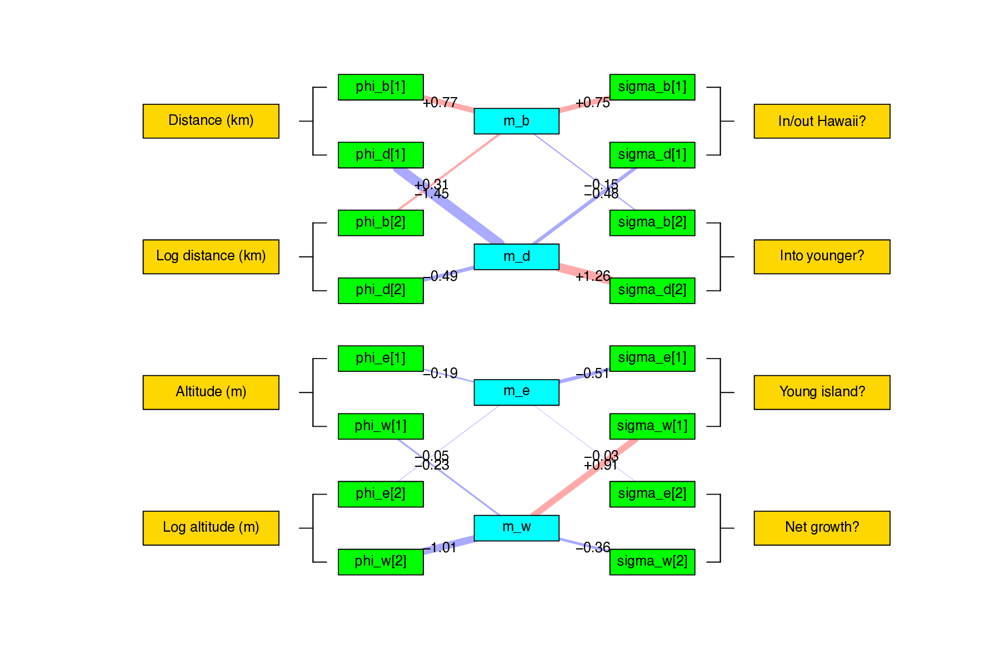
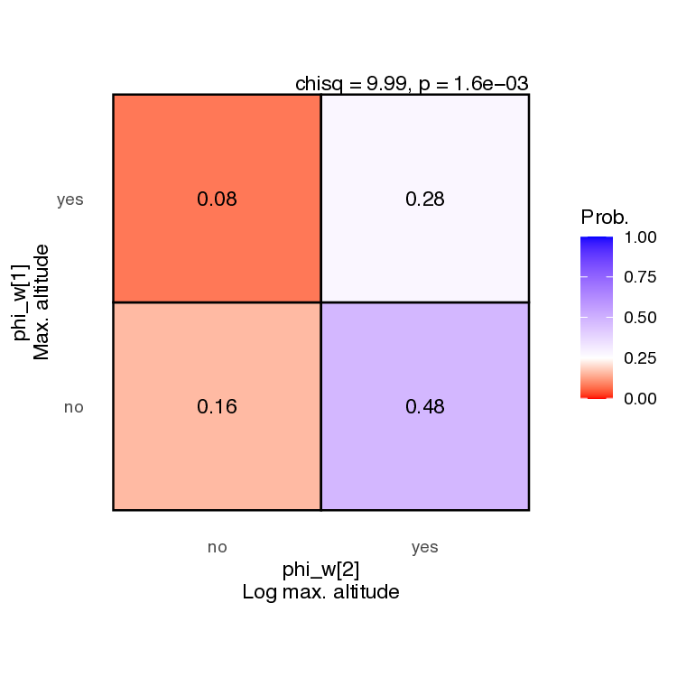

# fig_tools

Tools to assist with Feature-Informed GeoSSE (FIG) analyses in RevBayes. Currently, this repo only contains plotting tools.

## Quick use:

To generate images from the figure gallery, run:

```
# get repo
git clone git@github.com:hawaiian-plant-biogeography/FIG_tools.git

# enter repo
cd FIG_tools

# build figures
./scripts/make_all.sh

# view figure directory
open ./output
```

By default, the scripts generate figures for the `example_input` fileset. To generate figures for an alternative fileset, either modify the filepaths in `./make_all.sh` or modify all filepaths in the included RevBayes and R scripts.

Note: you must run the RevBayes script `./scripts/make_tree.Rev` to generate the MCC and ancestral state trees for `./scripts/plot_mcc_tree.R` and `./scripts/plot_states_tree.R`.

## Contents:
- `scripts` contains scripts to process FIG input/output
- `example_input` contains example data to process with `scripts`
- `output` contains example output produced by `scripts` against `example_input`

## Figure gallery

Per-region species richness [[code](https://github.com/hawaiian-plant-biogeography/FIG_tools/blob/main/scripts/plot_range_counts.R)]:<br>


Per-range species richness [[code](https://github.com/hawaiian-plant-biogeography/FIG_tools/blob/main/scripts/plot_range_counts.R)]:<br>


Maximum clade credibility tree [[code](https://github.com/hawaiian-plant-biogeography/FIG_tools/blob/main/scripts/plot_mcc_tree.R)]:<br>


Ancestral state tree [[code](https://github.com/hawaiian-plant-biogeography/FIG_tools/blob/main/scripts/plot_states_tree.R)]:<br>


Feature-rate network [[code](https://github.com/hawaiian-plant-biogeography/FIG_tools/blob/main/scripts/plot_feature_rate_network.R)]:<br>


Regional features over time [[code](https://github.com/hawaiian-plant-biogeography/FIG_tools/blob/main/scripts/plot_features_vs_time_grid.R)]:<br>


Biogeographic rates over time [[code](https://github.com/hawaiian-plant-biogeography/FIG_tools/blob/main/scripts/plot_rates_vs_time_grid.R)]:<br>


Biogeographic parameter estimates [[code](https://github.com/hawaiian-plant-biogeography/FIG_tools/blob/main/scripts/plot_model_posterior.R)]:<br>


Biogeographic reversible jump probabilities [[code](https://github.com/hawaiian-plant-biogeography/FIG_tools/blob/main/scripts/plot_rj_effects.R)]:<br>


This collaborative project was supported by the "Origin and Evolution of Hawaiian Plants" project (NSF DEB 2040347).
