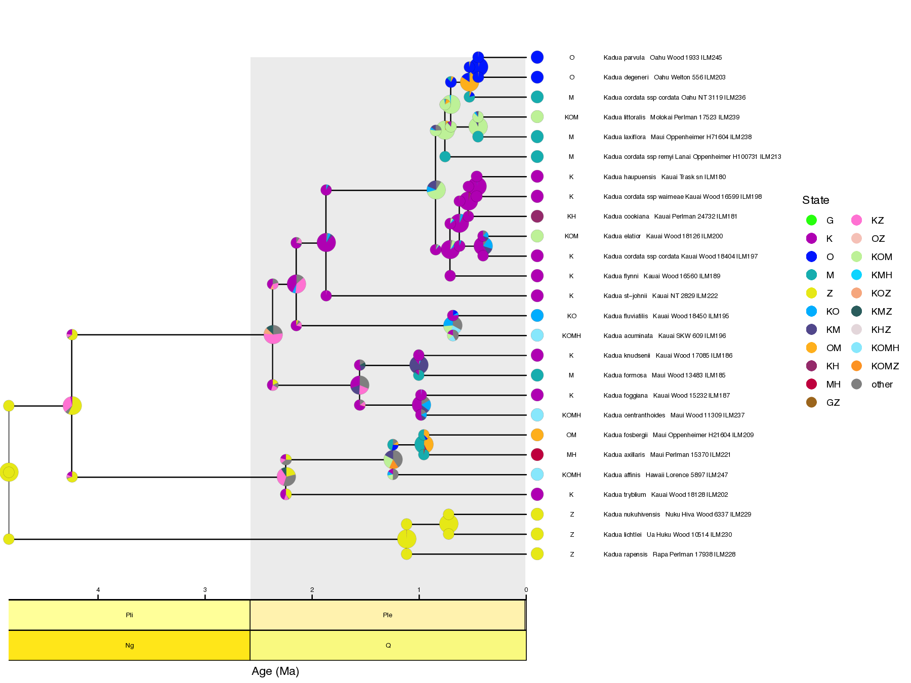

# FIG_tools

Tools to assist with Feature-Informed GeoSSE (FIG) analyses in RevBayes. Currently, this repo only contains plotting tools.

## Quick use:

```
# get repo
git clone git@github.com:hawaiian-plant-biogeography/FIG_tools.git

# enter repo
cd FIG_tools

# build figures
./scripts/make_all.sh

# view figure directory
open ./output
```

## Contents:
- `scripts` contains scripts to process FIG input/output
- `example_input` contains example data to process with `scripts`
- `output` contains example output produced by `scripts` against `example_input`

## Figure gallery

Per-region species richness:


Per-range species richness:


Maximum clade credibility tree:


Ancestral state tree:


Feature-rate network:


Regional features over time:


Biogeographic rates over time


Biogeographic parameter estimates


Biogeographic reversible jump probabilities


This collaborative project was supported by the "Origin and Evolution of Hawaiian Plants" project (NSF DEB 2040347).
